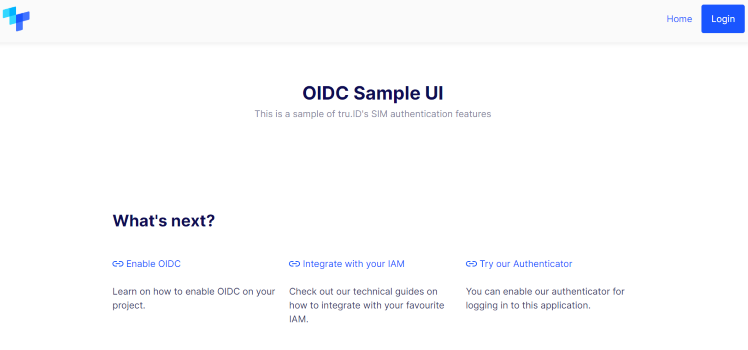

# OIDC Bridge Sample

This repository contains two applications:

* `bridge` - handles tru.ID OIDC flows
* `sample-ui` - UI that showcases a tru.ID OIDC login

You can learn more about tru.ID OIDC Flows by [reading this guide](https://developer.tru.id/docs/oidc/integration).


## Running the examples

Pre-requisites:

* IAM account (auth0, okta, etc.)
* tru.ID project configured for using the OIDC API ([see more](./bridge/README.md#pre-requisites))
* [ngrok](https://ngrok.com/)
* Docker
* JDK 11 or higher

There's a [compose file](./docker-compose.yml) which runs both the bridge, ui and an nginx gateway.

1. Build the application images

```shell
# build the bridge image
./mvnw -pl bridge clean package jib:dockerBuild "-Djib.to.tags=local"

# build the sample-ui image
./mvnw -pl sample-ui clean package jib:dockerBuild "-Djib.to.tags=local"

# you should see both images available locally
docker images tru.id/*
REPOSITORY           TAG       IMAGE ID       CREATED         SIZE
tru.id/sample-ui     latest    c4c3a489c415   8 seconds ago   290MB
tru.id/sample-ui     local     c4c3a489c415   8 seconds ago   290MB
tru.id/oidc-bridge   latest    3f2b407bedea   2 minutes ago   293MB
tru.id/oidc-bridge   local     3f2b407bedea   2 minutes ago   293MB
```

2. Start ngrok and capture the forwarding endpoint 

```
ngrok http 8080

# ... other output
Forwarding                    https://cac0-2a01-4b00-84b8-ed00-acf4-e49a-9616-3353.ngrok.io -> http://localhost:8080
# ... some more output
```

3. Copy the `.env.example` for your desired IAM prodiver (there's one on each `/integration-*` 
   folder) and populate it accordingly

```
# if you're using okta
cp ./integration-okta/.example.env .env

# edit the file
vi .env
```

For more IAM specific instructions:

* [Auth0](./integration-auth0/README.md)
* [Okta](./integration-okta/README.md)

4. Run the compose file with that configuration

```
export OIDC_CONFIG_FILE=.env 
docker compose up -d
```

5. Navigate to the sample-ui home

```
# base URL taken form point number 2
https://cac0-2a01-4b00-84b8-ed00-acf4-e49a-9616-3353.ngrok.io/sample-ui
```

You should see the following page:


