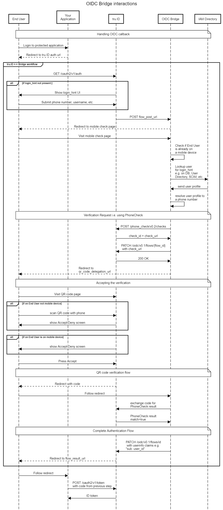

# OIDC bridge

This application leverages tru.ID OIDC API to intercept OIDC flows and perform SIM based authentication,
using the best method available e.g. PhoneCheck, Authenticator API, etc.

The current default verification rules are:

* Use a Push notification, if the IAM user has onboarded tru.ID mobile authenticator
* Use TOTP, if the IAM user has onboarded another mobile authenticator
* Otherwise, use PhoneCheck to verify the IAM User phone number

To learn more how you can build your own bridge, check the [integration guide](https://developer.tru.id/docs/oidc/integration).

Here is an example of how this bridge interacts with the different components:



## Pre-requisites

You need to configure your tru.ID Project in order to use the OIDC API. You can do so by adding an extra
`oidc` section with the following keys:

* `flow_post_url` - URL called when the OIDC flow is intercepted
* `flow_result_url` - URL called after the bridge has handled the verification (successfully on unsuccessfully)

Here is an example configuration, assuming you are running this bridge through the
[docker-compose.yml](../docker-compose.yml) provided in this repository.

```
PATCH /console/v0.2/workspaces/{id}/projects/{id}
Authorization: Bearer <workspace-token>
Content-Type: application/json-patch+json
[{
	"op": "add",
	"path": "/configuration",
	"value": {
		"oidc": {
            "flow_post_url": "https://<ngrok-base-url>/bridge/oidc-login",
            "flow_result_url": "<your-IAM-provider-3rd-party-OIDC-callback-url>"
        }
	}
}]
```

You will also need to provision an OAuth 2.0 `authorization_code` client. The resulting credential are
used to onboard the OIDC API with your IAM provider (normally as an external OIDC connection).

Here is an example:

```
POST /console/v0.2/workspaces/{id}/projects/{id}/credentials
Authorization: Bearer <workspace-token>
Content-Type: application/json

{
    "grant_type": "authorization_code"
}

200 OK
Content-Type: application/json
{
    client_id: "uuid",
    client_secret: "secret"
}
```
