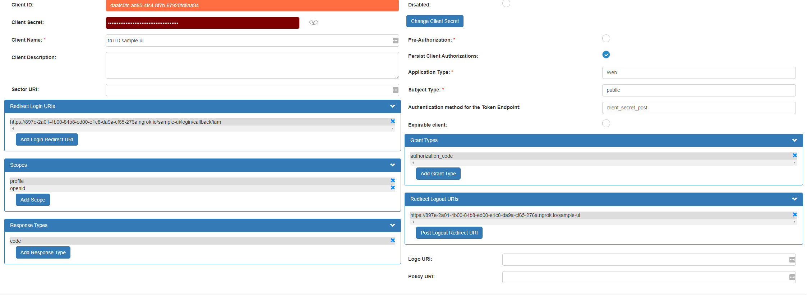
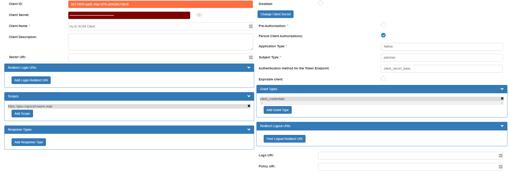

# Gluu OIDC integration

tru.ID leverages [Gluu Person Authentication Scripts](https://gluu.org/docs/gluu-server/4.4/admin-guide/custom-script/#person-authentication)
to provide an MFA login experience.

The first factor uses Gluu's username/password login mechanism.

The second factor will be controlled by our OIDC bridge ([more info](../bridge/README.md)).

## Pre-Requisites

- Gluu installation ([docker compose example](https://gluu.org/docs/gluu-server/4.4/installation-guide/install-docker/))
- Gluu SCIM module [enabled](https://gluu.org/docs/gluu-server/4.3/user-management/scim2/#enable-the-api) with OAUTH protection
- [tru.ID Person Authentication Script](./truid_mfa.py)

## Configuration

The [.example.env](./.example.env) file contains all the environment variables necessary to run a
full (`sample-ui`+`bridge`+`gluu`) flow and how to populate them.

### Create a tru.ID project that supports OIDC

- Sign in to [https://developer.tru.id/](https://developer.tru.id/)
- Go to **Console > Projects > Add Project**
- Give the project a name and click **Create Project**
- Fill in the **OIDC** section with ([see an example](../bridge/README.md)):
  - OIDC bridge application public URL e.g. `https://<ngrok-base-url>/bridge/oidc-login`
  - The Person Authentication script callback url e.g. `https://<gluu-installion-base-url>/oxauth/postlogin.htm`
- Create **Authorization Code** credentials by clicking the **Generate New** button
- Copy the `client_id` and the `client_secret` so you can use them in the next step, and set the
  `TRU_OIDC_CLIENT_ID` and `TRU_OIDC_CLIENT_SECRET` variables in your `.env` file.

## Create the Person Authentication Script in oxTrust UI

- Go to **Configuration > Person Authentication Scripts > Add Custom script configuration**
- Fill in the **Name** with `truid_mfa`
- Click **Add new property** to add 3 new custom properties:
  - `truid_api_base_url` -> `https://<dr>.api.tru.id`
  - `truid_client_id` -> OIDC `client_id` copied from the previous step
  - `truid_client_secret` -> OIDC `client_secret` copied from the previous step
- Copy the contents of [truid_mfa.py](./truid_mfa.py) to the **Script** section
- Click the **Enabled** checkbox to enable the script

## Create a new OIDC client in oxTrust UI

You'll need this so the `sample-ui` can use it as an IdP

- Go to **OpenID Connect > Clients > Add Client**
- Click **Generate Client Secret**
- Fill in the **Client Name** with `tru.ID sample-ui`
- Fill in the **Redirect Login URIs** with `https://<ngrok-base-uri>/sample-ui/login/callback/iam`
- Add `profile` and `openid` to the **Scopes**
- Add `code` to **Response Types**
- Set **Application Type** to `Web`
- Set **Subject Type** to `public`
- Set **Authentication method for the Token Endpoint** to `client_secret_post`
- Fill in the **Redirect Logout URIs** with `https://<ngrok-base-uri>/sample-ui`
- Copy the `client_id` and `client_secret` and set the `SAMPLE_UI_IAM_CLIENT_ID` and
  `SAMPLE_UI_IAM_CLIENT_SECRET` variables in your `.env` file

## Create a SCIM client for the bridge to query users

- Go to **OpenID Connect > Clients > Add Client**
- Click **Generate Client Secret**
- Fill in the **Client Name** with `tru.ID SCIM Client`
- Set **Application Type** to `Web`
- Set **Authentication method for the Token Endpoint** to `client_secret_basic`
- Set **Grant Types** to `client_credentials`
- Add `https://gluu.org/scim/users.read ` to the **Scopes**
- Copy the `client_id` and `client_secret` and set the `SAMPLE_GLUU_SCIM_CLIENT_ID` and
  `SAMPLE_GLUU_SCIM_CLIENT_SECRET` variables in your `.env` file

## Create a new user to test the integration

- Go to **Users > Manage People > Add Person**
- Fill in the required fields
  - remember your user's `username` and `password` fields as you'll use them to sign in
- Fill in the `Home Telephone Number` field with a valid number that you own, so you can test it
  - if that field is not available in `gluuCustomPerson` you might have to enable it through **Configuration > Attributes > Search for telephoneNumber** and enable it on the edit attribute screen

## Notes

- Any questions, visit [https://support.tru.id/](https://support.tru.id/)
